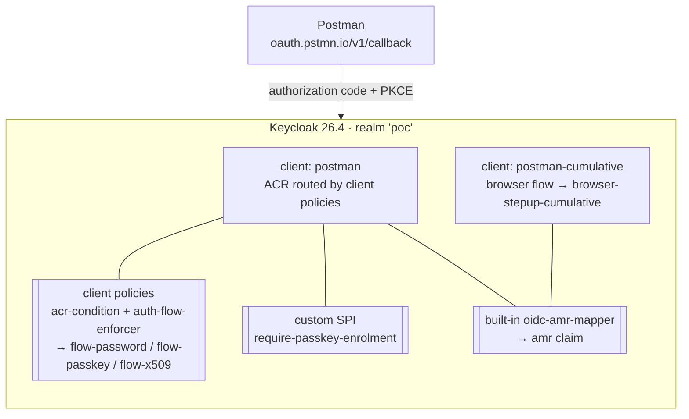

# Keycloak 26.4 — Passkey / Password Step-up by ACR (POC)

A proof-of-concept Keycloak 26.4 setup where a **Postman** OAuth2 client picks its login method by
requesting a Level of Authentication via `acr_values`: **password** (low), **passkey** (high), or a
**X.509 client certificate** — which is the **default** (used when no `acr_values` is sent). Issued
tokens carry an **`amr`** claim reflecting the method actually used.

> **Status:** proof-of-concept for local use (HTTP on `:8080`, HTTPS + mutual TLS on `:8443` for
> X.509). See [Production hardening](#production-hardening).

---

## What it demonstrates

Three ACR values map to three Levels of Authentication, and each selects exactly one method:

| Request | LoA | Method | `acr` | `amr` |
|---|---|---|---|---|
| *no* `acr_values` (**default**) | 3 | **X.509 client certificate** (mutual TLS on `:8443`) | `…/loa/x509` | `x509` |
| `acr_values=…/loa/high` | 2 | **identity-first passkey**: username → passkey (or, if none, password verify → create a passkey) | `…/loa/high` | `hwk` (`pwd` while enrolling) |
| `acr_values=…/loa/low` | 1 | **username + password** | `…/loa/low` | `pwd` |

X.509 is the **default and highest level**: with no `acr_values` (or an explicit `…/loa/x509`) the
client must present a trusted certificate (mapped by its SubjectAltName e-mail); with no certificate
the login is refused. The password and passkey paths never show a certificate prompt, and the
certificate path never shows a password.

Routing is done the **native Keycloak way** (26.2+): **client policies** map each ACR to a separate
authentication flow using the built-in **`acr-condition`** + **`auth-flow-enforcer`** — no custom ACR
code. There are three routing-target flows — **`flow-password`**, **`flow-passkey`**, **`flow-x509`** —
and three policies (`acr-low` → password, `acr-high` → passkey, `acr-x509` → certificate). The policy's
`auth-flow-loa` sets the achieved level, which becomes the token `acr`.

- **No `acr_values`** → the client's `default.acr.values` (`…/loa/x509`) is used → certificate.
- **Multiple `acr_values`** (a space-separated list) → every matching policy runs and the **last wins**;
  policies are ordered low → high → x509, so the **highest** requested method is selected
  (e.g. `acr_values="…/loa/low …/loa/high"` → passkey). *(Keycloak's LoA *condition* would instead
  collapse a multi-valued list to the minimum — the routing avoids that by selecting a whole flow.)*

The only remaining custom code is one small authenticator, **`require-passkey-enrolment`** (session-scoped
"create a passkey" for a passkey-less user). A second client, **`postman-cumulative`**, keeps the built-in
**cumulative** LoA flow (`loa/low` → password; default → password **then** passkey) as a contrast.

> **History:** earlier revisions of this PoC did the routing with two custom SPIs
> (`conditional-acr-exact` / `conditional-acr-highest`), on the assumption that vanilla Keycloak couldn't
> select methods disjointly by ACR. That was **wrong for 26.2+** — the native client-policy flow selector
> does exactly this.

---

## Architecture



ACR→method routing is **native** (client policies: `acr-condition` picks a flow via `auth-flow-enforcer`).
The only custom code is one small authenticator in `providers-src/` — **`require-passkey-enrolment`**
(session-scoped "create a passkey" for a passkey-less user). Everything else is stock Keycloak.

### Custom SPI: `require-passkey-enrolment`

Passwordless login needs an existing passkey, so a passkey-less user has to be bootstrapped onto one.
Keycloak has no *in-flow* passkey-registration authenticator — enrolment only runs as the
`webauthn-register-passwordless` **required action** — and this tiny authenticator is what triggers it.
It sits at the end of the passkey flow's password fallback (`flow-passkey` → `pk-no`), so it only fires
after a passkey-less user has **verified with a password**; "no verification → register" would let anyone
enrol a passkey onto any username.

The one detail that matters: it adds the required action to the **authentication session**
(`AuthenticationSessionModel.addRequiredAction`), not to the user account. A user-level required action
would persist and re-prompt on *every* future login (including the password-only `loa/low` path); the
session-scoped one applies to this login only, then it's gone. See
[docs/authentication-flow.md](docs/authentication-flow.md#passkey-enrolment-offer-to-create-one) for the
full write-up, and [README.md](#production-hardening) for the internal-API caveat.

---

## Quick start

**Prerequisites:** Docker + Docker Compose, OpenSSL, and Python 3 (for the smoke tests). The provider
is built inside a Maven container — no local JDK needed.

```bash
./scripts/setup.sh
```

This generates a demo PKI (`scripts/gen-certs.sh`), builds the custom provider (first run only), starts
Keycloak, and imports the `poc` realm. Keycloak comes up at **http://localhost:8080** and, for X.509,
**https://localhost:8443** (admin console `admin` / `admin`).

Smoke-test every path — both flows, both ACR paths, and X.509 (with and without a client cert):

```bash
./scripts/verify.sh
```

Expected output includes `amr=['x509']` for the **default** (certificate) path, `acr='…/loa/low'
amr=['pwd']` for the low path, and the create-a-passkey page for the `loa/high` (passkey) path.

Tear down (removes the database volume):

```bash
docker compose down -v
```

### Integration test for the custom provider

The SPI has a real integration test (JUnit 5 + [Testcontainers Keycloak](https://github.com/dasniko/testcontainers-keycloak)):
it boots a genuine Keycloak 26.4 container with the freshly compiled provider mounted and the actual
`realm/poc-realm.json` imported, then drives authorization-code + PKCE logins and asserts the `acr` /
`amr` claims for both the routed (`postman`) and cumulative clients.

Requires a local **JDK 21 + Maven** and a running container engine (Docker Desktop / Rancher Desktop /
colima). The runner auto-detects the Docker endpoint:

```bash
./scripts/it.sh          # mvn verify in providers-src/
```

The test lives at [`providers-src/src/test/java/it/westlund/kc/acr/AcrRoutingIT.java`](providers-src/src/test/java/it/westlund/kc/acr/AcrRoutingIT.java).
`scripts/build-provider.sh` builds the JAR with `-Dmaven.test.skip=true`, so packaging the provider
never needs Docker; the container-based test is run separately via `scripts/it.sh`.

---

## Configure Postman

### Option A — import the ready-made collection (recommended)

Import [`postman/keycloak-acr-poc.postman_collection.json`](postman/keycloak-acr-poc.postman_collection.json)
(Postman → *Import*). It contains five pre-wired requests across both clients and every ACR path.

To run one: open a request → **Authorization** tab → **Get New Access Token** → log in as
**`alice` / `alice`** → **Use Token** → **Send**. After Send, open the **Visualize** tab to see the
decoded `acr` / `amr`; they're also logged to the Postman Console (*View → Show Postman Console*), and
the raw token is stored in the `accessToken` collection variable.

The collection uses **Authorize using browser**, so login opens in your **system browser** (Chrome/Safari)
— which supports real passkeys, so the default passkey path can complete there too. The callback
`https://oauth.pstmn.io/v1/callback` is already an allowed redirect URI on both clients.

The ACR path is baked into each request's **Auth URL** (e.g. `?acr_values=http://example.com/loa/low`),
so you don't have to add parameters by hand. Collection variables (`baseUrl`, `realm`, client IDs,
`redirectUri`) are editable under the collection's *Variables* tab. The clients are **public** (PKCE,
no secret). Passkey login needs a platform/virtual authenticator, so the password paths are the ones
that complete inside Postman's popup — see [Testing passkeys](#testing-passkeys-manual-needs-a-virtual-authenticator).

### Option B — configure a request by hand

Create a request and set **Authorization → OAuth 2.0**:

| Field | Value |
|---|---|
| Grant type | Authorization Code (With PKCE) |
| Auth URL | `http://localhost:8080/realms/poc/protocol/openid-connect/auth` |
| Access Token URL | `http://localhost:8080/realms/poc/protocol/openid-connect/token` |
| Callback URL | `https://oauth.pstmn.io/v1/callback` |
| Client ID | `postman` (exact) or `postman-cumulative` |
| Code Challenge Method | SHA-256 |
| Scope | `openid` |

Log in as **`alice` / `alice`**.

**Pick a method** with an auth-request parameter (Postman: *Advanced Options → Auth Request → additional
parameters*): `acr_values = http://example.com/loa/low` for password, `…/loa/high` for passkey, or
`…/loa/x509` for the certificate. With **no** `acr_values` you get the **default**, X.509 — so a
certificate is required (see the X.509 section below).

**Offer passkey creation on the passkey (`loa/high`) path:** add `kc_action = webauthn-register-passwordless`
(optionally `skip_if_exists = true`). This is a **skippable**, application-initiated action — the user
is prompted to create a passkey only if they don't already have one, and can cancel.

Decode the returned token (e.g. at jwt.io) and inspect the `acr` and `amr` claims.

---

## Testing passkeys (manual, needs a virtual authenticator)

Passkey ceremonies can't run headlessly. To exercise passkey login and enrolment:

1. Open the login in **Chrome**. DevTools → **⋮ → More tools → WebAuthn** → *Enable virtual
   authenticator environment* → add a **CTAP2 / internal, resident-key, user-verification** authenticator.
2. Enrol on the **passkey path**: log in as `alice` with `acr_values=http://example.com/loa/high`.
   Enter the username → (no passkey yet) → verify with the password `alice` → you're prompted to
   **create a passkey**; register it against the virtual authenticator.
3. Log in again with `acr_values=…/loa/high` — enter the username, and now the **passkey** is used
   directly (no password). The token's `amr` is `["hwk"]`.

---

## X.509 client-certificate login

X.509 is the **default** login method and its own highest LoA level (level 3): a request with **no**
`acr_values` (or an explicit `…/loa/x509`) requires a trusted **client certificate** over mutual TLS on
`:8443`. `scripts/gen-certs.sh` creates a demo CA, Keycloak's server cert, and a client cert for
`alice` whose **SubjectAltName e-mail** (`alice@example.com`) maps to the account.

Quickest check (already part of `verify.sh`):

```bash
python3 scripts/test_x509.py --default   # no acr_values (default) + cert -> acr=…/loa/x509, amr=['x509']
python3 scripts/test_x509.py             # explicit acr=…/loa/x509 + cert -> same
python3 scripts/test_x509.py --no-cert   # no cert -> login refused (X.509 is required)
```

In **Postman**, use the **"X.509 client cert (loa/x509)"** request with **"Authorize using browser" ON**
and import `certs/alice.p12` (password `changeit`) into your **OS keychain / browser cert store** — the
*system browser* presents the certificate during the TLS handshake. Postman's own
*Settings → Certificates* client certs are **not** presented on the OAuth *authorize* leg (the embedded
auth window), so the non-browser mode can't do mutual TLS here; use the browser or the script.

> Keycloak runs with `KC_HTTPS_CLIENT_AUTH=request` (certificate optional) and trusts the demo CA via
> `KC_TRUSTSTORE_PATHS`. The `certs/` dir is git-ignored — regenerate with `scripts/gen-certs.sh`.

---

## Repository layout

```
docker-compose.yml            Keycloak 26.4 (digest-pinned), realm import, provider + certs mount
realm/poc-realm.json          Importable realm: clients, flows, ACR→LoA map, AMR mapper, user
providers-src/                Maven project for the require-passkey-enrolment SPI (+ integration test)
providers/keycloak-poc-providers.jar   Built provider (mounted into the container)
certs/                        Demo PKI (git-ignored; generated by scripts/gen-certs.sh)
postman/keycloak-acr-poc.postman_collection.json   Importable Postman collection
scripts/
  setup.sh                    Gen certs + build provider + start + wait healthy
  gen-certs.sh                Generate the demo CA / server cert / alice client cert
  build-provider.sh           Build the SPI JAR via a Maven container
  it.sh                       Run the provider integration test (mvn verify)
  build_realm.py              Rebuild the realm from scratch via Admin REST (source of truth)
  test_flow.py                Scripted auth-code+PKCE login; prints acr/amr
  test_x509.py                Scripted mutual-TLS login with alice's client cert
  verify.sh                   Run all smoke-test scenarios (incl. X.509)
docs/authentication-flow.md   Deep dive: flows, the cumulative-vs-exact problem, AMR + X.509 wiring
```

### Regenerating the realm

`realm/poc-realm.json` is imported on startup. To rebuild it against a running server (e.g. after
changing the flow) and re-export:

```bash
python3 scripts/build_realm.py        # rebuilds the 'poc' realm live
# then export via the admin console or partial-export and re-inject the test user
```

---

## Production hardening

This POC intentionally cuts corners. Before anything real:

- **HTTPS everywhere** (`start` not `start-dev`, real hostname, TLS). Passkeys require a secure context.
- Use a **confidential client** or front the token endpoint with an API gateway; drop `webOrigins: "+"`.
- Use a **managed database** (Postgres), not dev-mode H2.
- Set a real **WebAuthn attestation** policy and pin acceptable AAGUIDs if you must vet authenticators.
- Reconsider `loa-max-age = 0` (re-auth every request); pick a real SSO validity window.
- The `require-passkey-enrolment` authenticator uses an **internal Keycloak SPI** (Keycloak warns about this) — pin the
  Keycloak version and re-test on upgrades.
- **X.509 / mTLS:** the PKI here is a throwaway demo (self-signed CA, no-passphrase keys, no CRL/OCSP).
  For real use, issue certs from a proper CA, enable revocation checking (`x509-cert-auth.crl-*` /
  `-ocsp-*`), and consider `KC_HTTPS_CLIENT_AUTH=required` where every caller must present a cert.

## License

Apache-2.0 — see [LICENSE](LICENSE).
